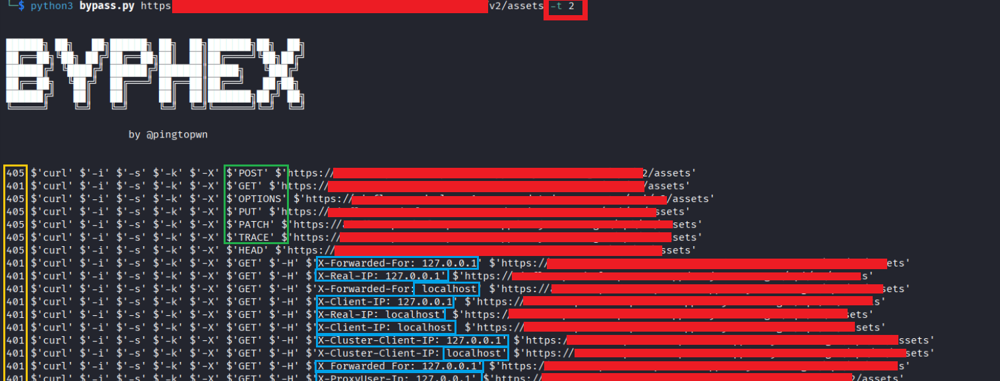

# Byphex

```
██████╗ ██╗   ██╗██████╗ ██╗  ██╗███████╗██╗  ██╗
██╔══██╗╚██╗ ██╔╝██╔══██╗██║  ██║██╔════╝╚██╗██╔╝
██████╔╝ ╚████╔╝ ██████╔╝███████║█████╗   ╚███╔╝
██╔══██╗  ╚██╔╝  ██╔═══╝ ██╔══██║██╔══╝   ██╔██╗
██████╔╝   ██║   ██║     ██║  ██║███████╗██╔╝ ██╗
╚═════╝    ╚═╝   ╚═╝     ╚═╝  ╚═╝╚══════╝╚═╝  ╚═╝

                    by @pingtopwn
```

Automated URL/Path bypass testing tool written in Python using curl.

Byphex automates common authorization bypass and path normalization tricks used during security testing against endpoints returning:

- 401 Unauthorized
- 403 Forbidden
- Access denied responses

---

# Features

- HTTP Method Testing
- Header-based bypass testing
- X-HTTP-Method-Override testing
- Case manipulation testing
- URL encoding bypass testing
- Alternative path normalization testing
- Thread modes
- Clean curl-based output
- Copy-paste ready curl commands

---

# Installation

Clone repository:

```bash
git clone https://github.com/pingtopwn/Byphex.git
```

Enter directory:

```bash
cd byphex
```

Make executable:

```bash
chmod +x byphex.py
```

---

# Usage

Default mode:

```bash
python3 byphex.py https://target.com/admin
```

Slow / Stealth mode:

```bash
python3 byphex.py https://target.com/admin -t 0
```

Fast mode:

```bash
python3 byphex.py https://target.com/admin -t 2
```

---

# Thread Modes

| Mode | Description |
|---|---|
| `-t 0` | Slow mode (3 second delay between requests) |
| `-t 1` | Default single-thread mode |
| `-t 2` | Fast mode (2 parallel curl requests) |

---

# HTTP Methods Used

Byphex tests:

- GET
- POST
- PUT
- OPTIONS
- PATCH
- TRACE
- HEAD

---

# Headers Tested

Byphex tests common proxy/IP related headers such as:

```http
X-Forwarded-For
X-Real-IP
X-Client-IP
X-Cluster-Client-IP
X_Forwarded_For
X-ProxyUser-Ip
True-Client-IP
X-Server-IP
X-Original-URL
X-Rewrite-URL
X-Forwarderd-Host
X-Custom-IP-Authorization
X-Originating-IP
X-Remote-IP
```

Values tested:

```http
127.0.0.1
localhost
```

Headers are tested using:

- GET
- POST
- PUT

---

# Method Override Testing

Byphex also tests:

```http
X-HTTP-Method-Override
```

Using methods like:

```http
POST
PUT
PATCH
OPTIONS
TRACE
```

---

# Path Manipulation Techniques

## Case Manipulation

Example:

```text
/admin
/Admin
/ADMIN
/aDmIn
```

---

## URL Encoding

Examples:

```text
/admin%00
/admin%20
/admin%09
/admin..;/
/admin/.
/%2e/admin
```

---

## Alternative Paths

Examples:

```text
/admin/
/admin//
/admin/./
/./admin
/admin/..;/
/admin/admin/
```

---

# Output Format

Output contains only:

- HTTP status code
- Full curl command

Example:

```bash
200 $'curl' $'-i' $'-s' $'-k' $'-X' $'GET' $'-H' $'X-Forwarded-For: 127.0.0.1' $'https://target.com/admin'
```

This allows direct copy-paste reproduction.

---

# Screenshots

Examples:

- 200 bypass response
- 401 response
- 403 response
- 404 response
- Fast mode execution
- Slow mode execution

Example markdown:

```markdown

```

---

# Example Testing Targets

```bash
python3 byphex.py https://target.com/admin
python3 byphex.py https://target.com/dashboard -t 2
python3 byphex.py https://target.com/private/api -t 0
```

---

# Notes

- Uses curl internally
- Only automates request generation
- Does not exploit vulnerabilities automatically
- Intended for authorized security testing environments only

---

# Author

@pingtopwn
